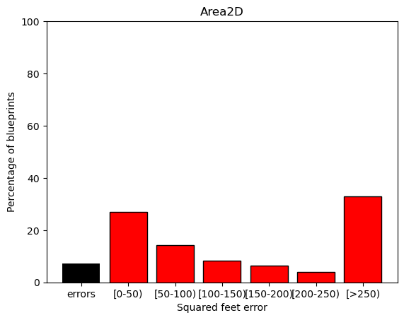
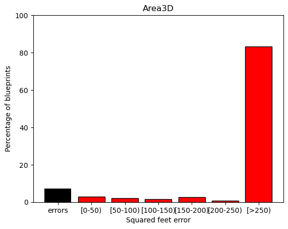
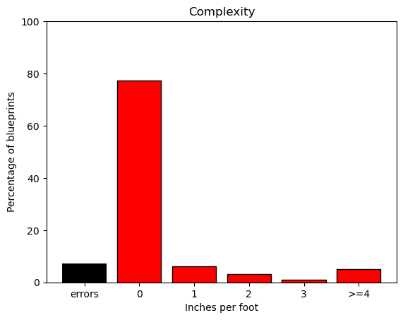

# Exercise 3

#### 👨‍🎓 This project was carried out during my master's degree in computer vision at URJC - Madrid

We want to compare the results obtained by a 3D object recognition algorithm.

## Goals

- Generate a graph with the 2D Area.
- Generate a graph with the 3D Area.
- Generate a graph with the Complexity.

## Requirements

* Python 3.7+

* matplotlib ~= 3.3.4
* numpy ~= 1.21.3
* pandas ~= 1.0.5

How to install all the requirements :

```bash
pip3 install -r requirements.txt
```

## Usage

```bash
python compute_stats.py --inference=./datasets/detection.csv --groundtruth=./datasets/groundtruth.csv --output_graphs=./output_stats
```

## Results

<p align="center">
  
</p>
<p align="center">
  <i>Result of the 2D area graph</i>
</p>

<p align="center">
  
</p>
<p align="center">
  <i>Result of the 3D area graph</i>
</p>

<p align="center">
  
</p>
<p align="center">
  <i>Result of the complexity graph</i>
</p>

## Authors

* **Luis Rosario** - *Member 1* - [Luisrosario2604](https://github.com/Luisrosario2604)