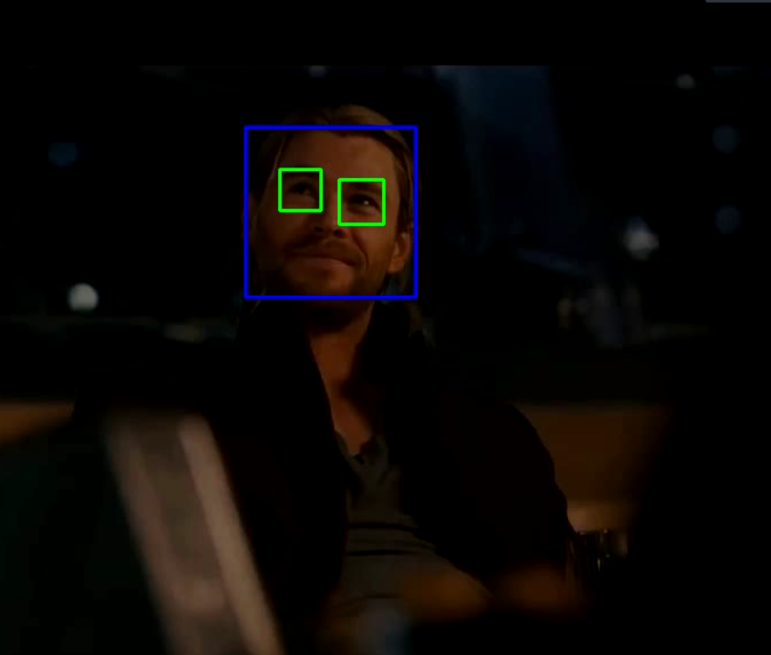

# Exercise 5

#### 👨‍🎓 This project was carried out during my master's degree in computer vision at URJC - Madrid

Detecting faces and eyes on a film trailer

## Goals

- Face detection
- Eye detection

## Requirements

* Python 3.7+
* opencv_python ~= 4.5.3.56

How to install all the requirements :

```bash
pip3 install -r requirements.txt
```

## Usage

```bash
python eyefacedetector.py --video=./media/short_avenger.mp4 --out=./result.avi
```

## Result

<p align="center">
  
</p>
<p align="center">
  <i>Result of the detection</i>
</p>

## Authors

* **Luis Rosario** - *Member 1* - [Luisrosario2604](https://github.com/Luisrosario2604)