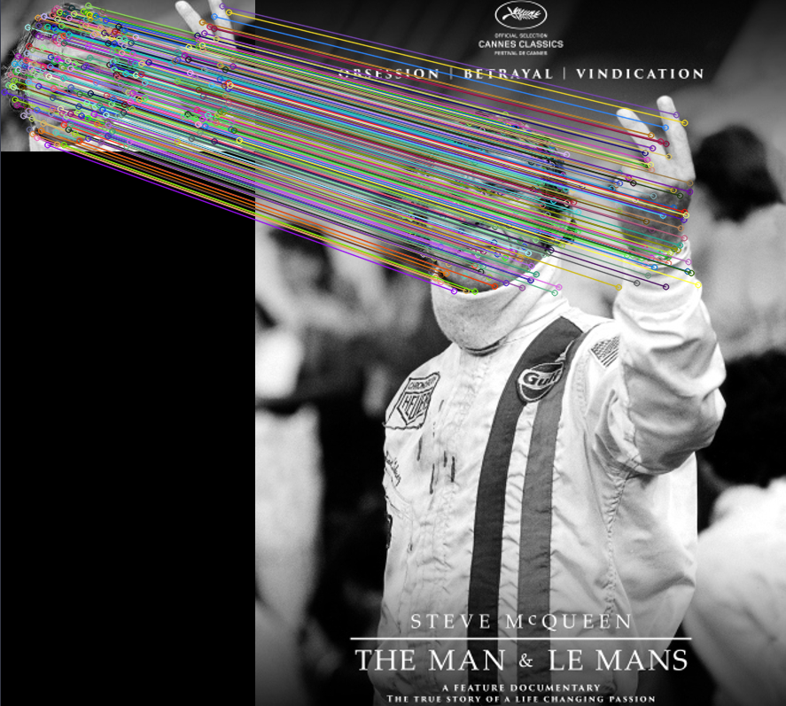
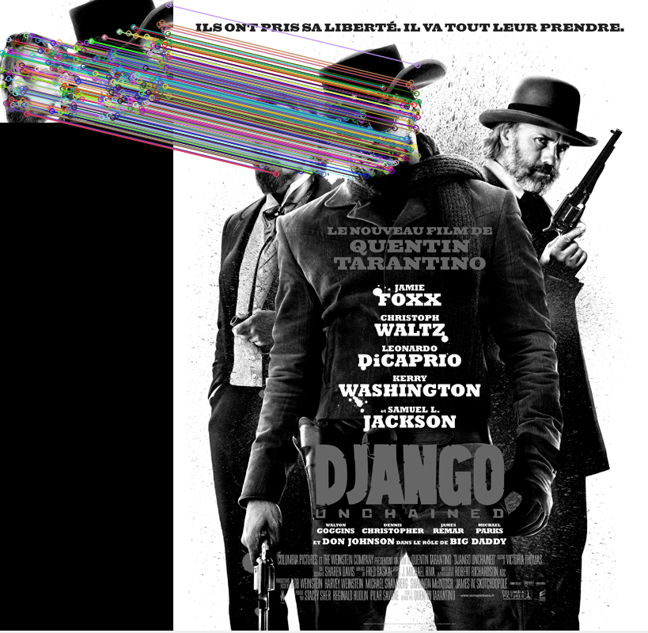
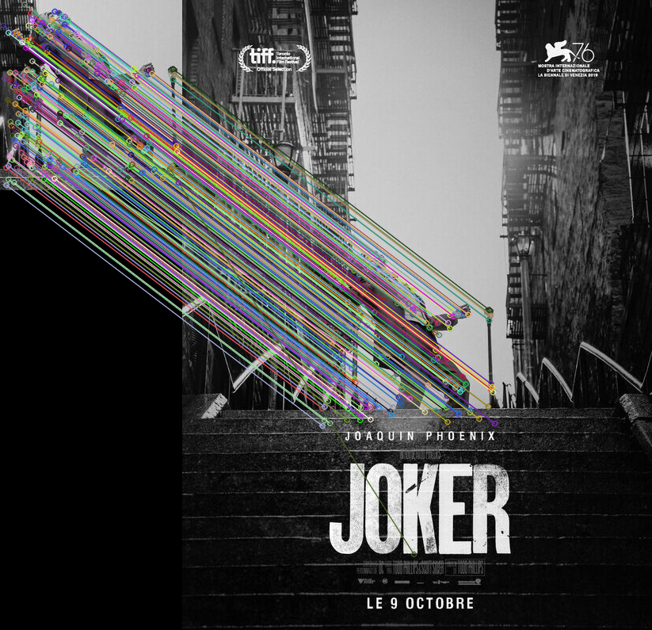

# Exercise 7

#### 👨‍🎓 This project was carried out during my master's degree in computer vision at URJC - Madrid

Feature matching with shift

## Goals

- Feature matching using SHIFT

## Keys

- 'Q' to exit

## Requirements

* Python 3.7+
* Opencv_python ~= 4.5.3.56


How to install all the requirements :

```bash
pip3 install -r requirements.txt
```

## Usage

One with minimum matches

```bash
python mediamatcher.py --query=./media/query/LGE.jpg --covers=./media/covers/
python mediamatcher.py --query=./media/query/Theman.jpg --covers=./media/covers/
```

## Results

<p align="center">
  
</p>
<p align="center">
  <i>First result of the detection</i>
</p>

<p align="center">
  
</p>
<p align="center">
  <i>Second result of the detection</i>
</p>

<p align="center">
  
</p>
<p align="center">
  <i>Third result of the detection</i>
</p>

## Authors

* **Luis Rosario** - *Member 1* - [Luisrosario2604](https://github.com/Luisrosario2604)