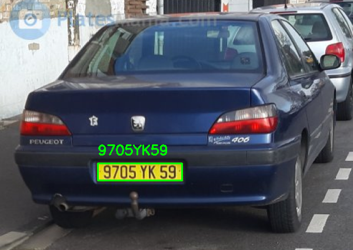
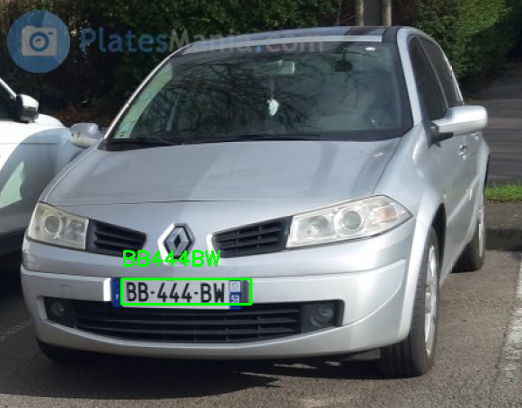

# Exercise 8.1

#### 👨‍🎓 This project was carried out during my master's degree in computer vision at URJC - Madrid

Apply the OpenCV text detection and recognition module (text) to the number plate identification problem.

## Goals

- Detect the number plate
- Apply th text and recognition module

## Keys

- 'Q' to exit

## Requirements

* Python 3.7+

* imutils ~= 0.5.4
* numpy ~= 1.21.3
* opencv_python ~= 4.5.5.64
* pytesseract ~= 0.3.8
* scikit_image ~= 0.18.3

How to install all the requirements :

```bash
pip3 install -r requirements.txt
```

## Usage

```bash
python text_recognition.py --image=media/test5.jpg
```

## Results

<p align="center">
  
</p>
<p align="center">
  <i>First result of the detection</i>
</p>

<p align="center">
  
</p>
<p align="center">
  <i>Second result of the detection</i>
</p>

## Authors

* **Luis Rosario** - *Member 1* - [Luisrosario2604](https://github.com/Luisrosario2604)