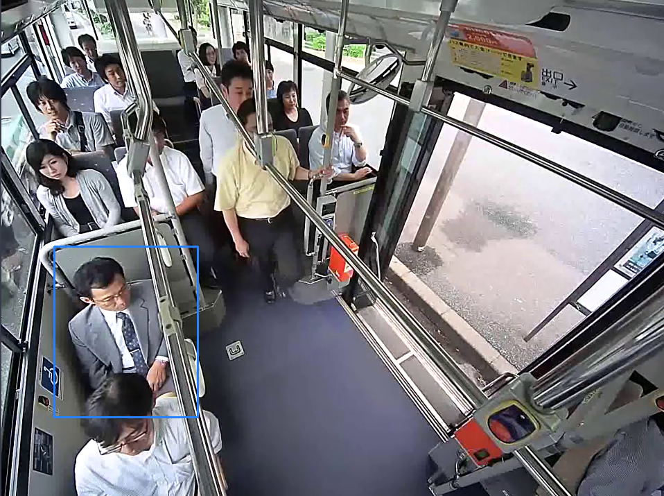
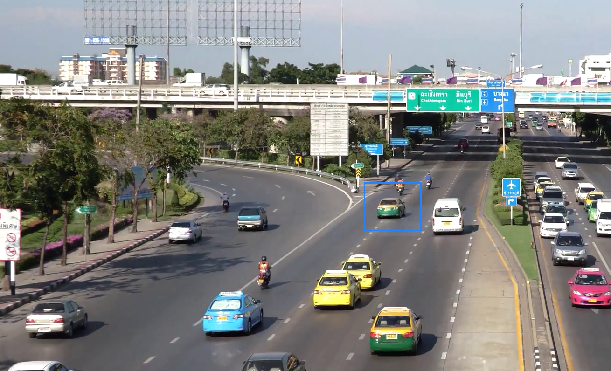

# Exercise 8.2

#### 👨‍🎓 This project was carried out during my master's degree in computer vision at URJC - Madrid

Use OpenCV visual tracking module to track an object or region of interest in a video sequence.

## Goals

- Use a virtual environement for this exercise
- Detect and follow the ROI (region of interest)

## Keys

- 'Q' to exit

## Virtual env

#### You need to start the virtual env to get the specific OpenCV version (3.4.11.45)

Create virtual env

```bash
pip3 install virtualenv
python -m venv .
```

Start virtual env

```bash
source bin/activate
```

Exit virtual env

```bash
deactivate
```

## Requirements

* Python 3.9.2

* numpy ~= 1.21.6
* opencv-contrib-python == 3.4.11.45

How to install all the requirements (You need to be in the virtual env !):

```bash
pip3 install -r requirements.txt
```

## Usage

Start tracking with default tracker (default kcf)

```bash
python visual_tracking_cv.py --image=media/road1.mp4
```

Start tracking with specific tracker

```bash
python visual_tracking_cv.py --image=media/road1.mp4 --tracker=mose
```

Tracker available :
* csrt
* kcf
* boosting
* mil
* tld
* medianflow
* mosse

Select with your mouse the object to track then press ENTER

## Results

<p align="center">
  
</p>
<p align="center">
  <i>First result of the detection</i>
</p>

<p align="center">
  
</p>
<p align="center">
  <i>Second result of the detection</i>
</p>

## Authors

* **Luis Rosario** - *Member 1* - [Luisrosario2604](https://github.com/Luisrosario2604)