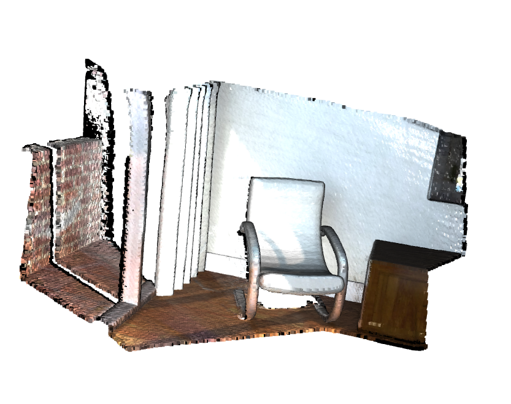
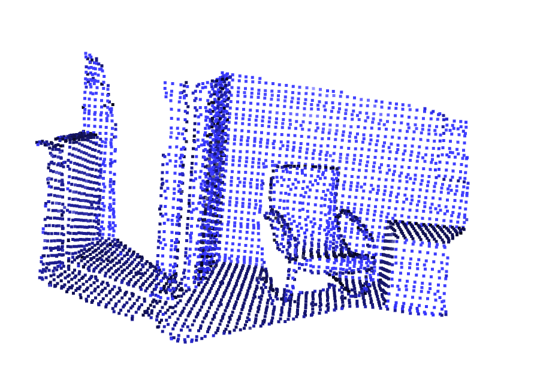

# Exercise 9

#### 👨‍🎓 This project was carried out during my master's degree in computer vision at URJC - Madrid

Develop a method for Open3D to filter outliers in a 3D point cloud.
There are different types of outlier filtering in the literature, in this exercise we will focus our attention on outlier filtering by radius (Python++ module).

## Goals

- Remove outliners of a cloud of 3D points

## Requirements

* Python 3.7+

* open3d ~= 0.15.2
* open3d_python ~= 0.3.0.0

How to install all the requirements :

```bash
pip3 install -r requirements.txt
```

## Usage

Usage of main algorithm

```bash
python outlier_removal.py --ipc=data/2.pcd --points=16 --radius=0.05 --opc=resulting_could.pcd
```

Bonus : If you want to visualize a 3D file

```bash
python visualization.py --file=data/2.pcd
```

## Result

<p align="center">
  
</p>
<p align="center">
  <i>Visualization of the 3D points</i>
</p>
<p align="center">
  
</p>
<p align="center">
  <i>After removing outliers</i>
</p>

## Authors

* **Luis Rosario** - *Member 1* - [Luisrosario2604](https://github.com/Luisrosario2604)