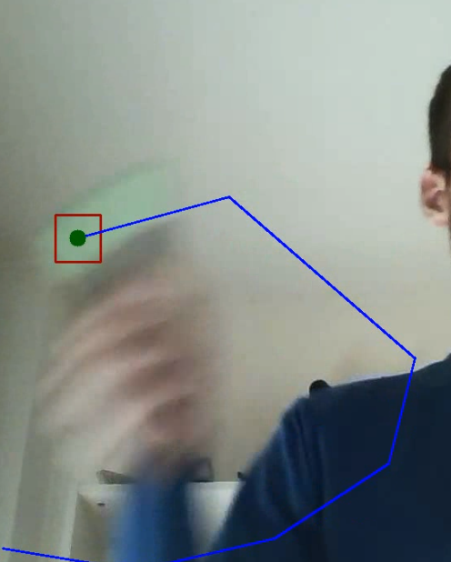

# Exercise 2

#### 👨‍🎓 This project was carried out during my master's degree in computer vision at URJC - Madrid

Artificial vision system that allows visual tracking by colour.
The system must be able to detect the object (if present) in each frame.

## Goals

- Apply a Gaussian filter to the frame to remove noise.
- Convert frame to HSV colour space
- Segment the frame using the selected colour range
- Remove noise in the resulting image
- Detect the different contours that appear in the image and keep the one that has the largest area

## Requirements

* Python 3.7+

* numpy == 1.21.3
* opencv_python == 4.5.3.56
* Pillow == 8.4.0

How to install all the requirements :
```bash
$ pip install -r requirements.txt
```

## Usage

```bash
$ python visual_tracking.py --video=./media/lapiz.avi --min_values 29 49 126 --max_values 88 255 255 --output=result.avi
```

## Results

<p align="center">
  
</p>
<p align="center">
  <i>Result of the visual color tracking (1 frame)</i>
</p>

## Authors

* **Luis Rosario** - *Initial work* - [Luisrosario2604](https://github.com/Luisrosario2604)